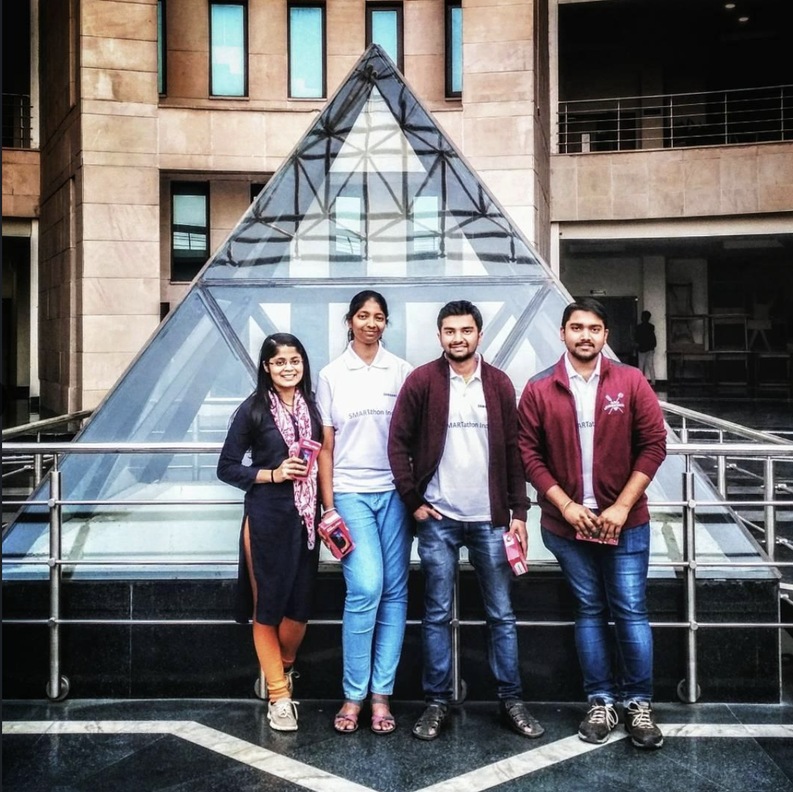
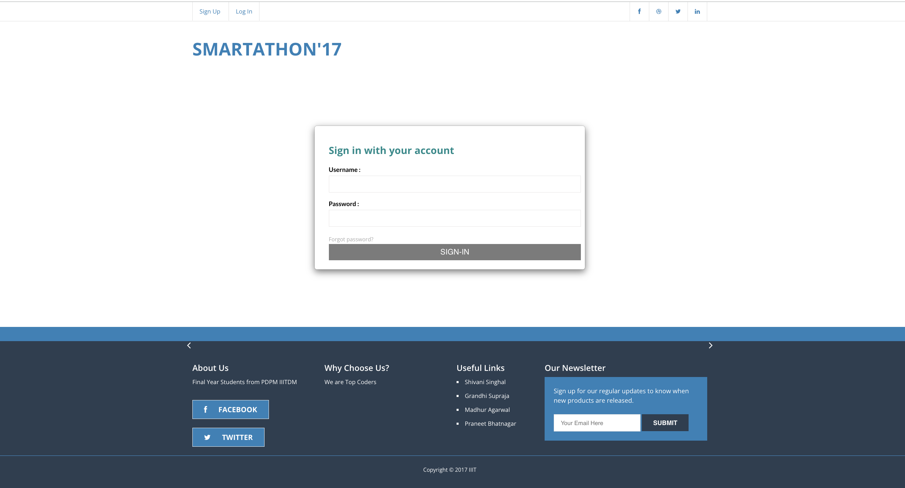
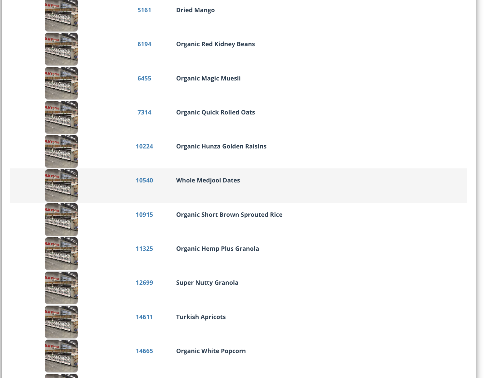
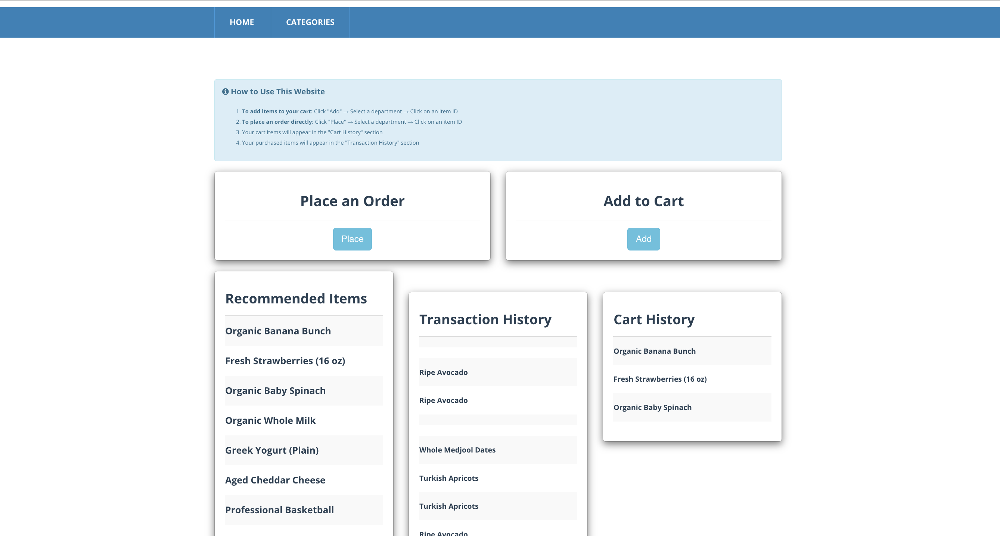

# E-commerce Recommendation System 🛍️

A smart e-commerce recommendation system that provides personalized product suggestions based on user behavior and preferences. This project was developed during the Samsung Smartathon at IIT Delhi and won the 2nd Runner-up position! 🏆

## 🌟 Hackathon Achievement

> ### *"Talent wins games, but teamwork wins hackathons!"* 

We're proud to have achieved the 2nd Runner-up position at Samsung Smartathon, IIT Delhi. This success story demonstrates the power of collaboration, innovation, and determination.

  
   
  
   
  <em>Wonderful experience with an amazing team and Samsung at IIT Delhi! 🎉</em>

## 🚀 Features

- **Smart Product Recommendations**: Utilizes advanced algorithms to suggest products based on user behavior
- **Personalized User Experience**: Adapts to individual shopping patterns
- **Real-time Updates**: Instantly updates recommendations as users interact with products
- **User-friendly Interface**: Clean and intuitive design for seamless shopping experience
- **Secure Authentication**: Robust user authentication system

## 💻 Technology Stack

- **Backend**: Django (Python)
- **Database**: SQLite
- **Frontend**: HTML, CSS, JavaScript
- **Machine Learning**: Recommendation algorithms based on collaborative filtering
- **Authentication**: Django's built-in authentication system

## 📸 Portal Screenshots

  
   
  <em>Smarathon Dashboard with login option</em>
    
  
   
  <em>Product Catalog</em>
    
  
   
  <em>Dashboard with Smart Suggestions</em>

## 📱 Usage

1. Register a new account or login with existing credentials
2. Browse through the product catalog
3. Add items to your cart
4. View personalized recommendations based on your shopping behavior
5. Complete purchases and track your order history

## 🤝 Team

A big shoutout to our amazing team who made this possible during the Samsung Smartathon at IIT Delhi! 

#samsung #smartathon #teamwork #datascience #2ndrunnersup #fun #learning #ecommerce #recommendationsystem

---

  <em>Built with ❤️ during Samsung Smartathon at IIT Delhi</em>

 